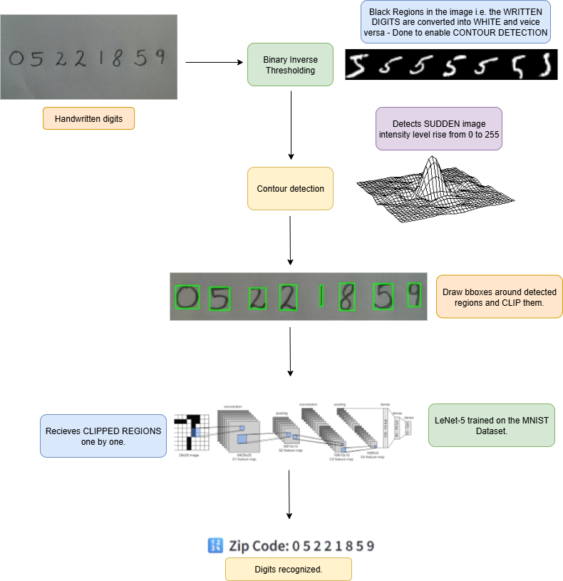

# 📨🤖Rudimentary handwritten pincode reading system using Binary Inverse Thresholding based Contour Detection & LeNet-5 🤔
This project is an attempt to replicate the world's first computer vision system. In the 80s the US Postal Service required a system to automatically recognize handwritten Zip Codes to sort mail more efficiently. Yann LeCun et. al. took on this challenge &amp; eventually ended up proposing LeNet-5. 

# Demo 👇
<video src="demo.mp4" controls width="640"></video>
[[Link to Demo]](https://youtu.be/VscNUvCFYMw "Click to watch")

# Overview of the pipeline


## 🚀 Features

* **Binary Inverse Image Thresholding**: A critical intensity transform that represents the handwritten digits with **intensity value 0** and the background with **intensity value 1** hence amplifying the **intensity gradient**.
* **OpenCV Contour Detection**: Records **coordinates** of the regions in the image where there is a **steep gradient rise from 0 to 255** and applies bounding boxes involving those coordinates.
* **LeNet-5 trained on the MNIST dataset**: The downstream model which **recognizes the digits** whose region bounding boxes were clipped.
---

## 📂 Project Structure

```bash
.
├── cards/                   # Handwritten zipcode images for testing
       ├── card1.png
       ├── card2.png
       ├── card3.png
       ├── card4.png
├── models/                   # Trained LeNet-5 weights
       ├── LeNet5_weights.png
├── requirements.txt      # Python dependencies.
├── CharLevel_Seg_Inference.ipynb     # Code that implements the entire pipeline: i/p --> Thresholding --> Contour detection & Clipping --> Recognition.
├── LeNet5_Train.ipynb  # Code that trains LeNet-5 on the MNIST Handwritten digit dataset.
├── demo.py            # A Streamlit demo of the entire project.
├── model.py   # Implements LeNet-5 in PyTorch.

```
## 📜 License

This project is licensed under the [MIT License](LICENSE).

---

## 🙌 Acknowledgements

* [LeNet-5](http://vision.stanford.edu/cs598_spring07/papers/Lecun98.pdf) - The LeNet-5 **Research Paper**.
* [Special Thanks](https://github.com/mdzahirdu/face-detection-mtcnn-cropping-pipeline) - Another repo that contains a clean implementation of **Binary Inverse Thresholding, Contour detection & LeNet-5 based digit recognition.**
---

### ⭐ If you find this project helpful, don’t forget to star the repo
